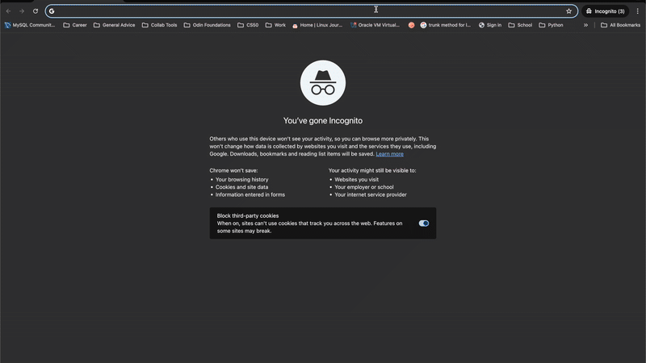

# CV-Maker

**CV-Maker** is a modern, responsive resume builder built with **React** and **Vite**, designed to help users create clean and professional resumes effortlessly. It’s fast, intuitive, and fully client-side, making it ideal for both quick edits and comprehensive CV creation. This was my first ever project in React.

[Live Demo](https://heartfelt-zabaione-381edb.netlify.app/)

---

## Preview



---

## Features

- **Single-Page Application (SPA)** – Lightning-fast experience with seamless component updates.
- **Customizable Layouts** – Tailor your CV sections easily.
- **Client-Side Storage** – Save and load your data locally without a backend.

---

## Installation

To set up the project locally, follow these steps:

```bash
# Clone the repository
git clone git@github.com:implexrr/cv-maker.git

# Navigate into the project directory
cd cv-maker

# Install dependencies
npm install
```

---

## Running the Application

### Development Mode

Start the development server:

```bash
npm run dev
```

### Production Build

Generate a production-ready build:

```bash
npm run prod
```

---

## Contributing

Contributions are welcome! If you have suggestions for improvements, feel free to:
- Submit a pull request
- Open an issue
- Fork the project and enhance it your way

---

## License

This project is licensed under the [MIT License](https://choosealicense.com/licenses/mit/). Feel free to use, modify, and distribute it as needed.

---

## Acknowledgments

Thanks to the open-source community for tools like React and Vite which make projects like this possible.
